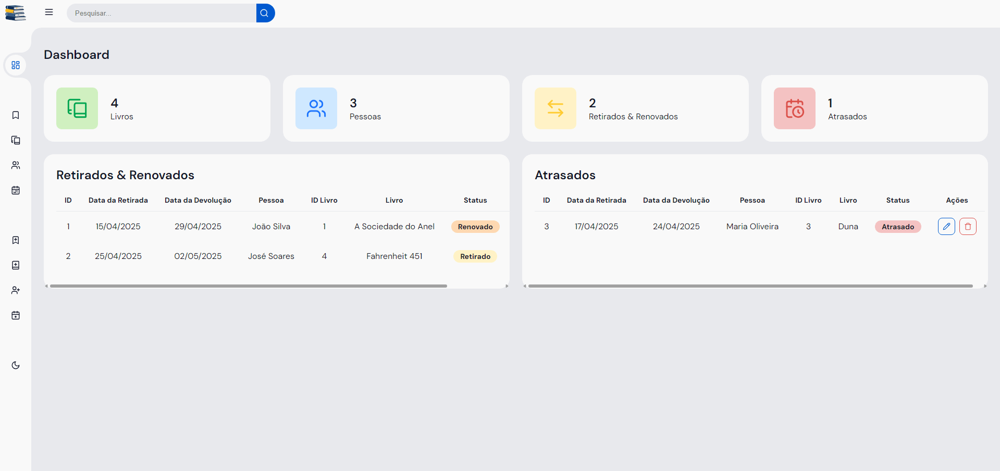
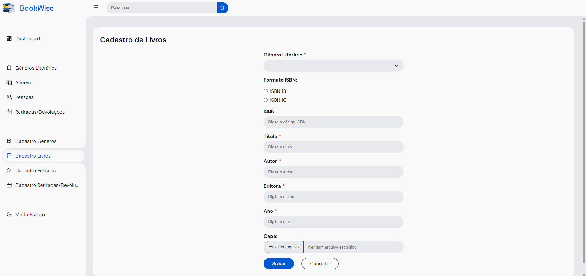
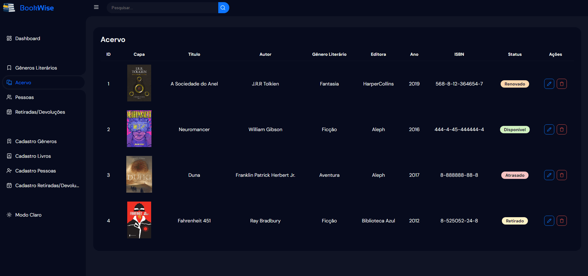
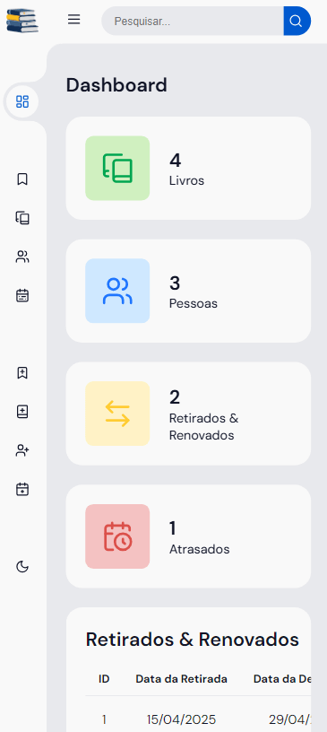

<p align="center">
    
</p>

<h1 align="center">
    BookWise - Gestão de Biblioteca
</h1>

<p align="left">
    <!--  -->
    
    
</p>

BookWise visa o controle e cadastro de livros, empréstimos, gêneros literários e pessoas de uma biblioteca.

## :hammer: Funcionalidades
- **Cadastro:**
  - `Cadastro de Gêneros Literários:` cadastro de nome de Gêneros Literários.
  
  - `Cadastro de Livros:` cadastro com Genêro Literário, ISBN, Título, Autor, Editora, Ano e Imagem da Capa.
  
  - `Cadastro de Pessoas:` cadastro com Nome e Sobrenome, Telefone e Email.
  
  - `Cadastro de Retiradas/Devoluções:` cadastro com Data de Retirada, Data de Devolução, Livro, Pessoa e Status.
  
- **Manutenção de Cadastros:**
  - `Edição:` todos os cadastros podem ser editados e atualizados.
  
  - `Exclusão:` cadastros podem ser excluidos.

- **Visualização:**
  - `Dashboard:` tela inicial em formato Dashboard, onde pode ser visualizado o total de livros e pessoas cadastrados. Também é exibidos quantos livros estão retirados e atrasados juntamente com seus registros.

  - `Pesquisa:` é posivel pesquisar por algum registro específico presente nas tabelas.

  - `Modo Escuro:` visualização da interface no Tema Escuro ou Tema Claro.
  
  - `Dispositivos Móveis:` interface otimizada para utilização em dispositivos nóveis.

- **Organização:**
  - `Registros:` todos os cadastros são organizados em tabelas.
  
  - `Status:` os livros e retiradas são organizados por status:
    - **1 - Retirado:** Um livro obtém o status `Retirado` quando um cadastro de retirada é criado para este livro.
  
    - **2 - Renovado:** Um livro retirado pode ser renovado. Para renovar um livro o cadastro da retirada deve ser atualizado com o status `Renovado`.
  
    - **3 - Devolvido/Disponível:** Quando um novo livro é cadastrado ou não está retirado ele é marcado automaticamento com o status `Disponível`. Já quendo um livro retirado é devolvido o cadastro da retirada deve ser atualizada como o status `Devolvido` ou excluída para o livro retirado estar disponível para retirada novamente.
  
    - **4 - Atrasado:** Livros com Datas de Devolução anterios a data do dia atual é marcado automaticamente com status `Atrasado`.
  

## :film_strip: Galeria
<p align="center">
  
  
  
  
</p>

## :file_folder: Acesso ao projeto
Você pode [acessar o código-fonte do projeto](https://github.com/GabrielSchiavo/bookwise) ou [baixá-lo](https://github.com/GabrielSchiavo/bookwise/archive/refs/heads/main.zip).

## 	:hammer_and_wrench: Abrir e rodar o projeto
Após baixar o projeto, deve verificar se possui os seguintes requisitos:

* PHP >=8.4.5
* Composer >=2.8.6
* Node.js >=22.14.0
* PostgreSQL >=17.4

`Configurando o projeto:`
1. Na pasta de instalação do PHP edite o arquivo `php.ini`, neste arquivo descomente as linhas a seguir:
   - extension=fileinfo
   - extension=pdo_pgsql
   - extension=pgsql
   
2. `Baixar e atualizar dependências:` Na raiz do projeto abra um terminal e execute:
    ```bash
    composer update
    ```
    ```bash
    composer install
    ```
    ```bash
    npm update
    ```
    ```bash
    npm install
    ```
    
3. Após seguir as etapas anteriores, abra o arquivo `.env`, localizado na raiz do projeto e altere as configurações de `DB_CONNECTION` para as configurações do seu Banco de Dados.
   
4. Depois abra um terminal na raiz do projeto e execute os seguintes comandos para configurar o Banco de Dados:
    ```bash
    php artisan migrate
    ```
    ```bash
    php artisan storage:link
    ```

5. Para executar o projeto, execute o comando a seguir em um terminal na raiz do projeto:
    ```bash
    php artisan serve
    ```

## :white_check_mark: Tecnologias utilizadas
* `PHP - 8.4.5`
* `Laravel - 12.7.1`
* `Composer - 2.8.6`
* `Node.js - 22.14.0`
* `jQuery - 3.7.1`
* `jQuery Mask - 1.14.16`
* `PostgreSQL - 17.4`
