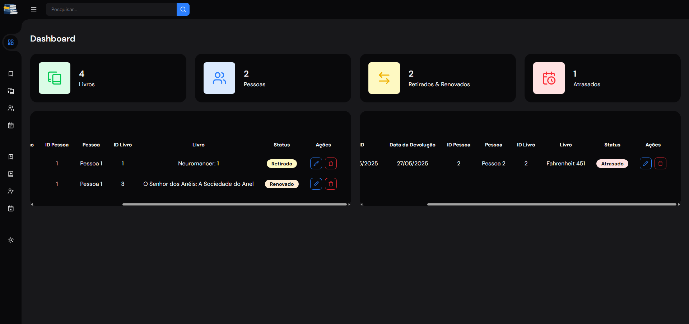
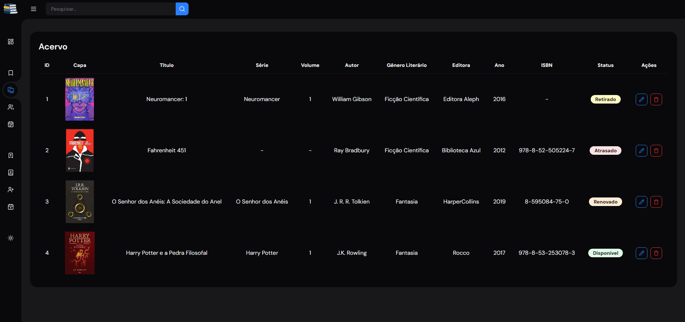
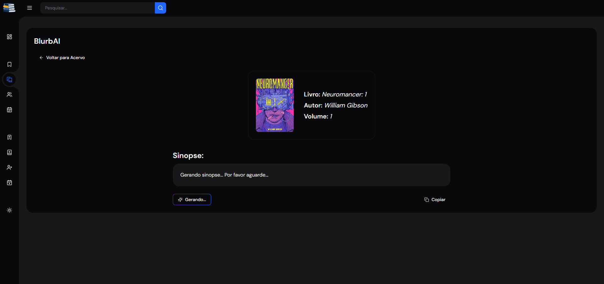
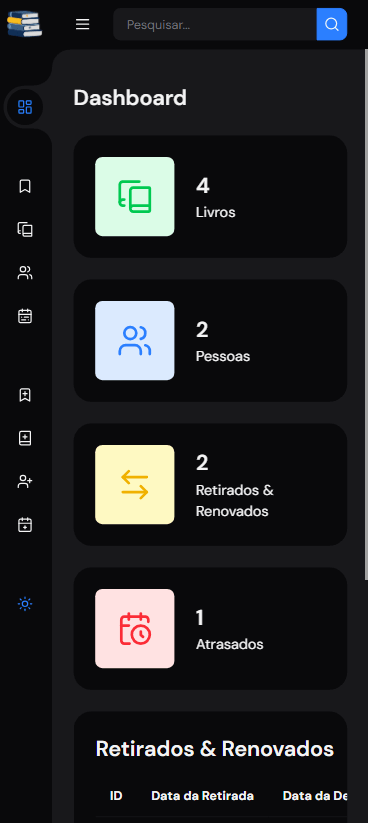

<div align="center">
    
</div>

<div align="center">

# BookWise - Gestão de Biblioteca

</div>

<div align="center">
    
    <!--  -->
    
</div>

<div align="center">

BookWise é uma aplicação web para controle e cadastro de livros, empréstimos, gêneros literários e pessoas de uma biblioteca.

</div>

## 🎯 Funcionalidades Principais

-   **Cadastro:**

    -   `Cadastro de Gêneros Literários:` Cadastro de nome de Gêneros Literários.

    -   `Cadastro de Livros:` Cadastro com Gênero Literário, ISBN, Título, Série, Volume, Autor, Editora, Ano e Imagem da Capa.

    -   `Cadastro de Pessoas:` Cadastro com Nome e Sobrenome, Telefone e E-mail.

    -   `Cadastro de Retiradas/Devoluções:` Cadastro com Data de Retirada, Data de Devolução, Livro, Pessoa e Status.

-   **Manutenção de Cadastros:**

    -   `Edição:` Todos os cadastros podem ser editados e atualizados.

    -   `Exclusão:` Cadastros podem ser excluídos.

-   **IA Generativa - SinopseAI:**
    -   `SinopseAI:` Utilizando o Ollama para executar e interagir com grandes modelos de linguagem, foi criada a SinopseAI uma IA com a função de gerar breves sinopses dos livros a partir dos seus Títulos, Volumes e Autores.
-   **Visualização:**

    -   `Dashboard:` Tela inicial em formato Dashboard, onde pode ser visualizado o total de livros e pessoas cadastradas. Também são exibidos quantos livros estão retirados e atrasados juntamente com seus registros.

    -   `Pesquisa:` É possível pesquisar por algum registro específico presente nas tabelas.

    -   `Modo Escuro:` Visualização da interface no Tema Escuro ou Tema Claro.

    -   `Dispositivos Móveis:` Interface otimizada para utilização em dispositivos móveis.

-   **Organização:**

    -   `Registros:` Todos os cadastros são organizados em tabelas.

    -   `Status:` Os livros e retiradas são organizados por status:

        -   **1 - Retirado:** Um book obtém o status `Retirado` quando um cadastro de retirada é criado para este book.

        -   **2 - Renovado:** Um book retirado pode ser renovado. Para renovar um livro o cadastro da retirada deve ser atualizado com o status `Renovado`.

        -   **3 - Devolvido/Disponível:** Quando um novo book é cadastrado ou não está retirado, ele é marcado automaticamente com o status `Disponível`. Já quando um livro retirado é devolvido, o cadastro da retirada deve ser atualizado como o status `Devolvido` ou excluído para o livro retirado estar disponível novamente.

        -   **4 - Atrasado:** Livros com Datas de Devolução anteriores a data do dia atual é marcado automaticamente com status `Atrasado`.

## 🎞️ Galeria

<p align="center">
  
  
  
  
</p>

## ⚙️ Setup e Configuração

### ⚠️ Pré-requisitos:

-   **PHP** >= 8.4.5
-   **Composer** >= 2.8.6
-   **PNPM** >= 10
-   **Node.js** >= 22.17.0
-   **Docker**
-   **Docker Compose**

### 🔧 Setup:

1. `Configurar PHP:` Na pasta de instalação do PHP abra o arquivo `php.ini`, neste arquivo descomente seguintes linhas:
    ```env
      extension=fileinfo
      extension=pdo_pgsql
      extension=pgsql
    ```

2. `Instalar e atualizar dependências:`
  - Pacotes PHP:
    - Instalar e atualizar pacotes:
      ```bash
        composer update
      ```

    - Instalar pacotes respeitando a versão fornecida:
      ```bash
        composer install
      ```

  - Pacotes JS:
    - Instalar e atualizar pacotes:
      ```bash
        pnpm update
      ```
    - `OU` Escolher quais pacotes atualizar:
      ```bash
        pnpm up -i
      ```

    - Instalar pacotes respeitando a versão fornecida:
      ```bash
        pnpm install
      ```

3. `Configurar Banco de Dados e Ollama:` execute o comando abaixo e aguarde o Ollama concluir a instalação do modelo de IA
    ```bash
      docker-compose up -d
    ```

   - Acesse `http://localhost:11434/` e verifique se o Ollama está em execução

   - `OBS:` o Ollama está configurado para executar utilizando GPUs NVIDIA. Em caso de dúvidas acesse: https://docs.docker.com/desktop/features/gpu/
  
   - Documentação oficial do Ollama: https://github.com/ollama/ollama

4. `Configurar as variáveis de ambiente:` renomeie o arquivo `.env.example` para `.env` e garanta que o arquivo contenha as seguintes variáveis:
    ```env
      DB_CONNECTION=pgsql
      DB_HOST=localhost
      DB_PORT=5432
      DB_DATABASE=bookwise
      DB_USERNAME=root
      DB_PASSWORD=12345

      OLLAMA_API_BASE_URL=http://localhost:11434
      OLLAMA_DEFAULT_MODEL=llama3.2
      OLLAMA_TIMEOUT=60
    ```

5. `Configurar Laravel:`
    - Gere a variável `APP_KEY` no arquivo `.env`:
      ```bash
        php artisan key:generate
      ```

    - Limpe o cache de configuração do Laravel
      ```bash
        php artisan config:clear
      ```

    - Crie um link simbólico do diretório `storage/app/public` para `public/storage`, tornando-o acessível pela web:
      ```bash
        php artisan storage:link
      ```

6. `Executar migrações do banco de dados:` crie as tabelas e os relacionamentos
    ```bash
      php artisan migrate
    ```

7. `Compilar os ativos:`
    ```bash
      pnpm build
    ```

8. `Executar o projeto:`
  - **Desenvolvimento:**
    Em um terminal inicie o Vite:
    ```bash
      pnpm dev
    ```

    Em outro terminal inicie o servidor de desenvolvimento do Laravel:
    ```bash
      php artisan serve
    ```

  - **Produção:**
    ```bash
      pnpm build
    ```

    -   No arquivo `.env` garanta que as variáveis **APP_ENV** e **APP_DEBUG** estejam idênticas as seguintes:
      ```env
        APP_ENV=production
        APP_DEBUG=false
      ```

    - Acesse a documentação oficial do Laravel para obter o paso a paso de **deployment**: https://laravel.com/docs/12.x/deployment

## ⚡ Scripts Disponíveis

- `pnpm dev` - Executa o servidor em modo de desenvolvimento com hot reload
- `pnpm build` - Compila os ativos do projeto
- `php artisan migrate` - Executa as migrações do Banco de Dados
- `php artisan serve` - Inicia o projeto

## ✅ Tecnologias utilizadas

-   `PHP - 8.4.5`
-   `Laravel - 12.7.1`
-   `Vite - 6.3.4`
-   `Composer - 2.8.6`
-   `Node.js - 22.14.0`
-   `jQuery - 3.7.1`
-   `jQuery Mask - 1.14.16`
-   `Tailwind CSS - 4.1.4`
-   `PostgreSQL - 17.4`
-   `Ollama - 0.9.0`
