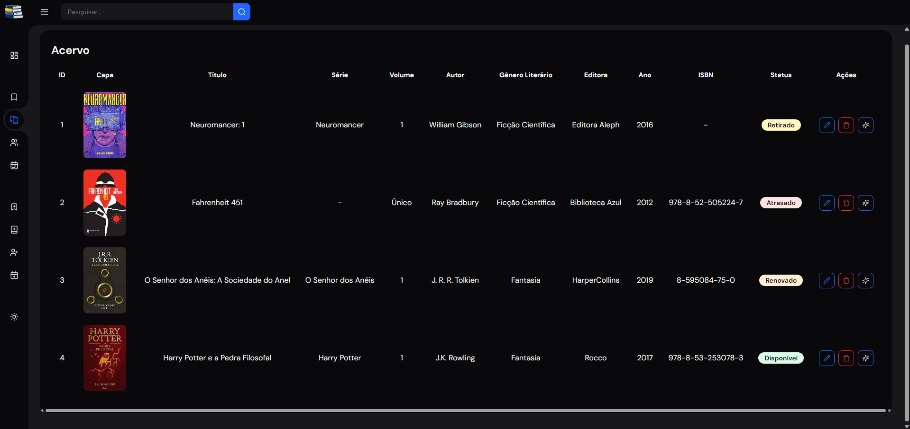

<p align="center">
    
</p>

<h1 align="center">
    BookWise - Gestão de Biblioteca
</h1>

<p align="center">
    
    <!--  -->
    
</p>

<p align="center">
    BookWise visa o controle e cadastro de livros, empréstimos, gêneros literários e pessoas de uma biblioteca.
</p>

## :hammer: Funcionalidades
- **Cadastro:**
  - `Cadastro de Gêneros Literários:` cadastro de nome de Gêneros Literários.
  
  - `Cadastro de Livros:` cadastro com Genêro Literário, ISBN, Título, Série, Volume, Autor, Editora, Ano e Imagem da Capa.
  
  - `Cadastro de Pessoas:` cadastro com Nome e Sobrenome, Telefone e Email.
  
  - `Cadastro de Retiradas/Devoluções:` cadastro com Data de Retirada, Data de Devolução, Livro, Pessoa e Status.
  
- **Manutenção de Cadastros:**
  - `Edição:` todos os cadastros podem ser editados e atualizados.
  
  - `Exclusão:` cadastros podem ser excluidos.
  
- **IA Generativa - BlurbAI:**
  - `BlurbAI:` utilizando o Ollama para executar e interagir com grandes modelos de linguagem foi criado a BlurbAI uma IA com a função de gerar breves sinopses dos livros a partir dos seus Títulos, Volumes e Autores.
  
- **Visualização:**
  - `Dashboard:` tela inicial em formato Dashboard, onde pode ser visualizado o total de livros e pessoas cadastrados. Também é exibidos quantos livros estão retirados e atrasados juntamente com seus registros.

  - `Pesquisa:` é posivel pesquisar por algum registro específico presente nas tabelas.

  - `Modo Escuro:` visualização da interface no Tema Escuro ou Tema Claro.
  
  - `Dispositivos Móveis:` interface otimizada para utilização em dispositivos nóveis.

- **Organização:**
  - `Registros:` todos os cadastros são organizados em tabelas.
  
  - `Status:` os livros e retiradas são organizados por status:
    - **1 - Retirado:** Um book obtém o status `Retirado` quando um cadastro de retirada é criado para este book.
  
    - **2 - Renovado:** Um book retirado pode ser renovado. Para renovar um book o cadastro da retirada deve ser atualizado com o status `Renovado`.
  
    - **3 - Devolvido/Disponível:** Quando um novo book é cadastrado ou não está retirado ele é marcado automaticamento com o status `Disponível`. Já quendo um book retirado é devolvido o cadastro da retirada deve ser atualizada como o status `Devolvido` ou excluída para o book retirado estar disponível para retirada novamente.
  
    - **4 - Atrasado:** Livros com Datas de Devolução anterios a data do dia atual é marcado automaticamente com status `Atrasado`.
  

## :film_strip: Galeria
<p align="center">
  
  
  
  
</p>

## :file_folder: Acesso ao projeto
Você pode [acessar o código-fonte do projeto](https://github.com/GabrielSchiavo/bookwise) ou [baixá-lo](https://github.com/GabrielSchiavo/bookwise/archive/refs/heads/main.zip).

## 	:hammer_and_wrench: Abrir e rodar o projeto
Após baixar o projeto, deve verificar se possui os seguintes requisitos:

* PHP >=8.4.5
* Composer >=2.8.6
* Node.js >=22.14.0
* PostgreSQL >=17.4
* Ollama >=0.9.0

`Configurando o projeto:`
1. Na pasta de instalação do PHP edite o arquivo `php.ini`, neste arquivo descomente as linhas a seguir:
   
   - extension=fileinfo
   - extension=pdo_pgsql
   - extension=pgsql
   
2. `Baixar e atualizar dependências:` Na raiz do projeto abra um terminal e execute:
   
    - Pacotes PHP:
      - Atualiza e intalla pacotes para versão mais recente:

          ```bash
          composer update
          ```

      - Instala pacotes respeitaremos a versão fornecida:
  
          ```bash
          composer install
          ```

    - Pacotes JS:
      - Instala e atualiza pacotes para versão mais recente:
          ```bash
          npm update
          ```

      - Instala pacotes respeitaremos a versão fornecida:
          ```bash
          npm install
          ```
    
3. Instalar `Ollama`:
    - Utilizando `Docker`:
      - Baixe a imagem oficial do Ollama no Docker Hub. E crie um container.
  
      - `Ollama com GPU`: para executar o Ollama no Docker utilizando GPU acesse: https://docs.docker.com/desktop/features/gpu/
  
      - Abra o terminal do Docker no caontainer do Ollama e execute:
  
        - `Instalar` um modelo de linguagem:
          ```bash
          ollama pull <nomeDoModelo>
          ```

        - `Excluir` um modelo de linguagem:
          ```bash
          ollama rm <nomeDoModelo>
          ```

        - `Listar` modelos de linguagem instalados:
          ```bash
          ollama list
          ```

        - `Iniciar` modelos de linguagem instalados:
          ```bash
          ollama run <nomeDoModelo>
          ```

      - Para verificar se o servidor do Ollama está ativo acesse a URL do servidor. URL padrão: http://localhost:11434/
  
    - Documentação oficial do Olamma: https://github.com/ollama/ollama
  
4. Localize o arquivo `.env.example` na raiz e siga as próximas etapas:
    - Altere o nome do arquivo `.env.example` para `.env`;
  
    - Configurar `Banco de Dados`:
        - No arquivo `.env` encontre as váriaveis `DB_...`. Altere seus valores para as suas respectivas configurações de Banco de Dados.
  
    - Configurar `Ollama`:
        - No arquivo `.env` é possivel encontrar as variáveis `OLLAMA_...` com suas definições padrões. Caso esteja usando configurações para o Ollama diferentes das padrões altere as variáveis `OLLAMA_...` e altere seus valores para as suas respectivas configurações.
   
5. Depois abra um terminal na raiz do projeto e execute os seguintes comandos para configurar o Laravel:
   
   - Gera o valor para a variável `APP_KEY` no arquivo `.env`, necessária para execusão do Laravel:
  
      ```bash
      php artisan key:generate
      ```
      
   - Após cada alteração no arquivo `.env` execute o comando abaixo para limpar o cache de configuração do Laravel:
  
      ```bash
      php artisan config:clear
      ```

6. Ainda na raiz do projeto execute os seguintes comandos para configurar o Banco de Dados:
   
   - Cria as tebelas e os relacionamentos executando as migrations:
  
      ```bash
      php artisan migrate
      ```

    - Cria um link simbólico do diretório `storage/app/public` para `public/storage`, tornando esses arquivos acessíveis pela web:
  
      ```bash
      php artisan storage:link
      ```

7. Agora você deve compilar os assets do projeto. Exixtem duas maneiras para compilar os assets:
   
   - `Compilar:` compila e agrupa os ativos os deixando prontos para implantação em produção (`não` atualiza os ativos automaticamnete):
  
      ```bash
      npm run build
      ```
  
   - `Atualizar em tempo real:` executa o servidor de desenvolvimento local do `Vite`, onde detectará automaticamente as alterações nos arquivos dos ativos e as refletirá instantaneamente em qualquer janela aberta do navegador:
  
      ```bash
      npm run dev
      ```

8. Para executar o projeto, execute o comando a seguir em um terminal na raiz do projeto:
  
   - Inicia o servidor de desenvolvimento local do `Laravel`:

      ```bash
      php artisan serve
      ```

9.  Caso coloque este projeto em produção:
  
   - No arquivo `.env` altere as variáveis `APP_ENV`, `APP_DEBUG` para:

      ```bash
      APP_ENV=production 
      APP_DEBUG=false
      ```
  
## :white_check_mark: Tecnologias utilizadas
* `PHP - 8.4.5`
* `Laravel - 12.7.1`
* `Vite - 6.3.4`
* `Composer - 2.8.6`
* `Node.js - 22.14.0`
* `jQuery - 3.7.1`
* `jQuery Mask - 1.14.16`
* `Tailwind CSS - 4.1.4`
* `PostgreSQL - 17.4`
* `Ollama - 0.9.0`
